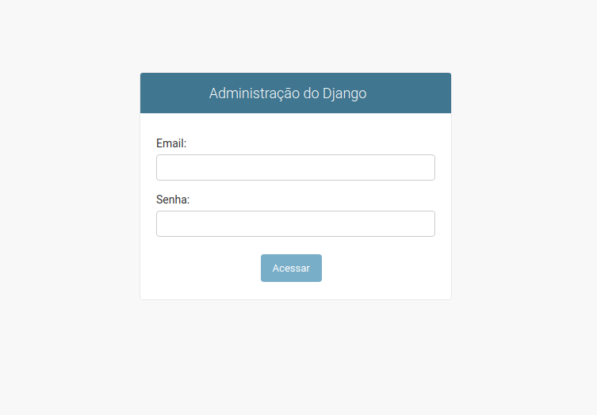

# UAC Registry :: Database

## Modelling

In accordance with the functional requsites specified [here](../../docs/pdf/tech_assessment.pdf), there must be three entities:

* **Address**: entity that contains information regarding the address of an user.
* **Client**: a entity that can have multiple users associated with it.
* **User**: a entity that must aggregate credentials for OAuth2 authentication (with JWT). Many users can be related to many addresses,
having one of them as a main address. In respect to the client, a user must be associated to only one client.

### ERD

The Entity Relationship diagram (ERD) for the above entities can be generated via the `devenv` script suite, by running the following command:

```bash
(env) ~/uac-registry/ $ ./scripts/devenv.py erd
```

A file `uac-registry-erd.png` will be generated and saved in `docs/img`. The resulting image is as follows:

<span style="display:block;text-align:center"></span>

## Building and Running

The Docker Compose service, which creates an virtualized instance of the PostgreSQL server, can be built via the `devenv` script suite.
At the terminal, in the project root, execute the command:

```bash
(env) ~/uac-registry/ $ ./scripts/devenv.py build database
```

To run the service, execute:

```bash
(env) ~/uac-registry/ $ ./scripts/devenv.py start database
```

To make sure that the database is running properly, run `docker ps` in the terminal. The output should be something like:

```
CONTAINER ID        IMAGE                         COMMAND                  CREATED             STATUS                            PORTS                    NAMES
17f7cf891783        uac-registry-database-image   "docker-entrypoint.s…"   2 hours ago         Up 2 seconds (health: starting)   0.0.0.0:5432->5432/tcp   uac-registry-database
```

Alternatively, you can also follow the container logs by running `./scripts/devenv.py logs database`. The output is similar to:
```
uac-registry-database | PostgreSQL Database directory appears to contain a database; Skipping initialization
uac-registry-database | 
uac-registry-database | 2020-12-02 19:04:54.638 -03 [1] LOG:  starting PostgreSQL 13.1 on x86_64-pc-linux-musl, compiled by gcc (Alpine 9.3.0) 9.3.0, 64-bit
uac-registry-database | 2020-12-02 19:04:54.638 -03 [1] LOG:  listening on IPv4 address "0.0.0.0", port 5432
uac-registry-database | 2020-12-02 19:04:54.638 -03 [1] LOG:  listening on IPv6 address "::", port 5432
uac-registry-database | 2020-12-02 19:04:54.652 -03 [1] LOG:  listening on Unix socket "/var/run/postgresql/.s.PGSQL.5432"
uac-registry-database | 2020-12-02 19:04:54.670 -03 [20] LOG:  database system was shut down at 2020-12-02 17:52:38 -03
uac-registry-database | 2020-12-02 19:04:54.728 -03 [1] LOG:  database system is ready to accept connections
```

With the database server up and running, it is time to run the Django migrations, in order to create the SQL database.
To do this, execute:
```bash
(env) ~/uac-registry/ $ ./scripts/devenv.py migrate
```

If, for some reason, the code base for the SQL models have been altered, you must create new migrations. For that, you must run:
```bash
(env) ~/uac-registry/ $ ./scripts/devenv.py make_migrations     # Create new migration files
(env) ~/uac-registry/ $ ./scripts/devenv.py migrate             # To update the SQL structure in the server
```

To stop the container, just run `./scripts/devenv.py stop database`.

## Django Admin

The Django frameworks provides also the Django Admin page, which is an interface for the user to interact with both the database and the implemented API.
This interface is accessible, [via browser](http://localhost:8080/admin), as shown below:

<span style="display:block;text-align:center"></span>

Naturally, in order to the platform be accessible, both `database` and `backend` services must be up and running, and also a superuser must be created.
The latter can be achieved via the `devenv` script suite, by running `./scripts/devenv.py su`.

The credentials for the superuser are specified in the back-end [`.env` file](../backend/docker/.backend.env), in the environment variables `DJANGO_SUPERUSER_EMAIL` and
`DJANGO_USERNAME_PASSWORD`.

Once logged in, the platform provides a dashboard, with tools for inserting new data into the database, as shown below:

<span style="display:block;text-align:center"></span>

[<< Back](../../README.md)